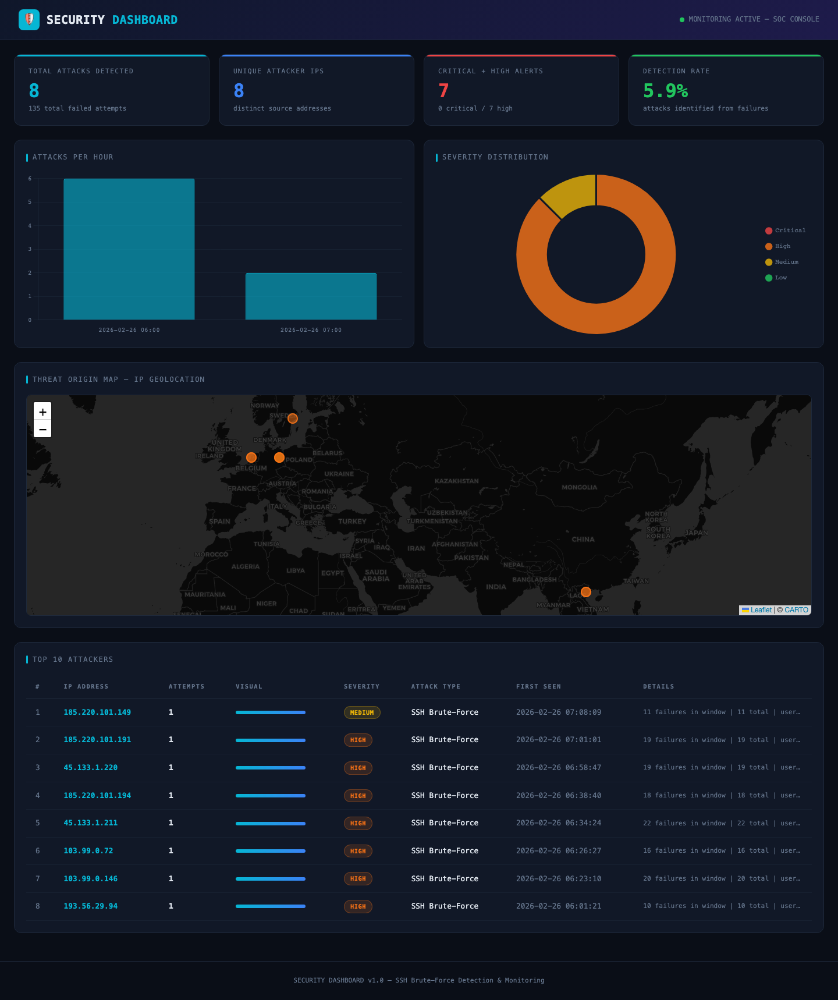

# Security Dashboard

Security Log Analyzer & Dashboard — Real-time monitoring of SSH/Apache logs, brute-force detection, IP geolocation & threat visualization.



## Features

- **SSH Log Generator** — 1000 realistic sshd entries with embedded brute-force attack patterns
- **Brute-Force Detection** — Sliding-window algorithm (5+ failures / 10 min) with severity classification
- **SQLite Persistence** — All alerts stored with timestamp, IP, attack type, severity, details
- **Web Dashboard** — Professional dark-theme SOC interface built with Flask
- **Real-Time Charts** — Attacks per hour (bar) + severity distribution (doughnut) via Chart.js
- **Threat Map** — Live IP geolocation plotted on a dark Leaflet map using ip-api.com
- **Top Attackers Table** — Ranked table with visual attempt bars and severity badges
- **Responsive Design** — Works on desktop, tablet, and mobile

## Quick Start

```bash
git clone https://github.com/Wolfnicos/security-dashboard.git
cd security-dashboard
python -m venv venv
source venv/bin/activate
pip install -r requirements.txt

# 1. Generate logs and detect attacks
python scripts/run_analysis.py

# 2. Launch the web dashboard
python run.py
# Open http://localhost:5000
```

## Dashboard Components

| Component | Description |
|---|---|
| **Stat Cards** | Total attacks, unique IPs, critical+high alerts, detection rate |
| **Hourly Chart** | Bar chart showing attack frequency over time |
| **Severity Pie** | Doughnut chart with critical/high/medium/low distribution |
| **Threat Map** | Leaflet map with geolocated attacker IPs (ip-api.com) |
| **Attackers Table** | Top 10 IPs ranked by attempt count with severity badges |

## Architecture

### Detection Engine

1. **Log Generation** (`app/services/log_generator.py`)
   - Mixes normal SSH traffic (~70% accepted) with 8 brute-force clusters
   - Each attacker IP produces 10-25 rapid failures within a ~9 minute window
   - Realistic usernames, ports, timestamps, and subnet patterns

2. **Log Parsing** (`app/services/log_parser.py`)
   - Regex-based extraction of timestamp, IP, user, event type
   - Sliding-window brute-force detection with configurable threshold
   - Severity: `low` (5-9) → `medium` (10-19) → `high` (20-49) → `critical` (50+)

3. **Persistence** (`app/models/database.py`)
   - SQLite with indexed IP and severity columns
   - Alert schema: id, timestamp, ip, attack_type, severity, details, created_at

### Web Dashboard

4. **Flask Routes** (`app/routes/dashboard.py`)
   - `GET /` — Main dashboard with server-side rendered data
   - `GET /api/geo` — JSON endpoint for IP geolocation data

5. **Geolocation** (`app/services/geolocation.py`)
   - Batch IP lookup via ip-api.com (free, no key required)
   - Returns country, city, lat/lon, ISP for map plotting

6. **Frontend** (`app/templates/index.html`)
   - Single-page dark SOC theme with CSS custom properties
   - Chart.js 4.x for bar and doughnut charts
   - Leaflet.js with CARTO dark tiles for threat map
   - Fully responsive (desktop → mobile)

## Project Structure

```
security-dashboard/
├── app/
│   ├── routes/
│   │   └── dashboard.py       # Flask routes + API
│   ├── models/
│   │   └── database.py        # SQLite alert persistence
│   ├── services/
│   │   ├── log_generator.py   # Fake SSH log generator
│   │   ├── log_parser.py      # Parser + brute-force detector
│   │   ├── reporter.py        # Terminal color reports
│   │   └── geolocation.py     # IP geolocation (ip-api.com)
│   ├── templates/
│   │   └── index.html         # Dashboard UI
│   └── static/
├── scripts/
│   └── run_analysis.py        # CLI entry point
├── docs/
│   └── dashboard_screenshot.png
├── data/                      # Generated logs (gitignored)
├── config/
│   └── settings.py
├── requirements.txt
└── run.py                     # Flask entry point
```

## Tech Stack

- **Python 3.11+** / **Flask** — Backend
- **Chart.js 4.x** — Charts and visualizations
- **Leaflet.js** + CARTO dark tiles — Threat map
- **SQLite** — Alert storage
- **ip-api.com** — IP geolocation (free tier)

## License

MIT
